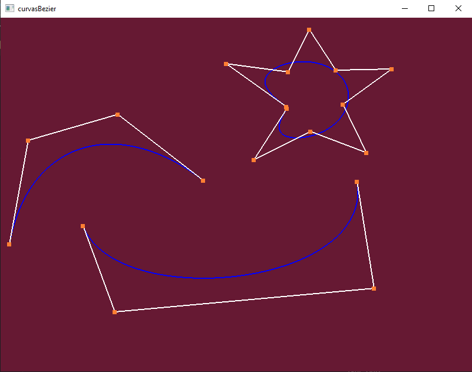

# Curvas de Bezier en OpenGL

- Descomprimir extraer.zip
- Click izquierdo para colocar un punto
- Click derecho para empezar una nueva curva
- Barra espaciadora para limpiar todas las curvas

# Imagenes
